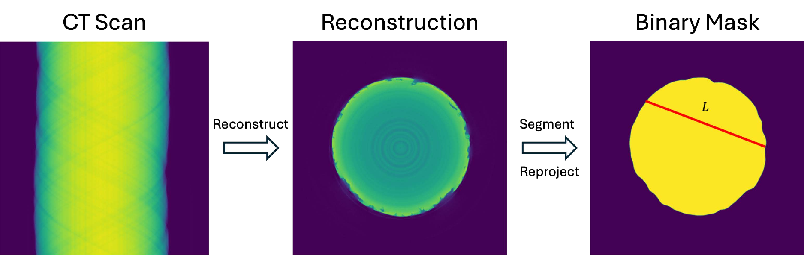

.. _CalibrationScan:

====================
The Calibration Scan
====================

This page tells you what to scan and how, before you touch any
software.

The calibration object
----------------------

Scan a set of homogeneous rods of known pure materials.  Good targets
span a range of attenuation.  The XCal paper used rods of magnesium,
aluminum, titanium, and vanadium, each 0.5 mm to 1 mm in diameter.
Metal rods of 99.9 percent purity are inexpensive stock items.

Guidelines:

* Use three or four rods of different materials.  More materials of
  different attenuation strengths make the estimate more robust.
* Choose rod diameters so the most attenuating rod still transmits a
  measurable signal at your lowest voltage.  A rod that blacks out the
  detector contributes nothing.
* Mount the rods parallel to the rotation axis, spaced so they do not
  overlap in most views.

The scans
---------

Take two or three scans of the target at different instrument
settings, changing only one thing between scans:

* On a tube system, change the source voltage (for example 40, 80, and
  150 kV).
* On a system with fixed voltage, such as a synchrotron, change the
  filtration.

Everything else stays fixed.  The repeated scans at different settings
are what make the estimation well posed; a single scan gives a much
less reliable estimate.

Each scan should be a normal tomographic acquisition with its air scan
(and dark scan where the scanner uses one).  Full angular coverage is
needed for at least one scan per rod arrangement, so that xcal can
reconstruct and segment the rods.  Additional scans can use sparse
views; the spectral fit itself uses only a small subset of views.

   How xcal measures the rod shapes.  Each rod scan is reconstructed,
   the rod is segmented into a binary mask, and the mask is forward
   projected to give the path length L of every ray through the rod.
   These path lengths, together with the known material, determine the
   attenuation at each energy.

What to record
--------------

For each scan, note the source voltage, which filters were in the
beam, and which rods were in the field of view.  These facts go into
the calibration script.  Geometry and pixel size come from the scanner
files automatically.
