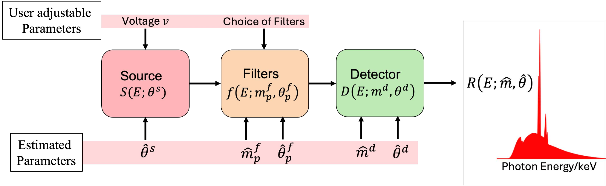

xcal: X-ray CT Spectral Calibration
===================================

**Find out what spectrum your X-ray CT scanner actually produces.**

An X-ray CT detector never records its spectrum directly, yet
quantitative methods such as beam hardening correction and
dual-energy material decomposition need it.  xcal estimates the
effective spectrum from calibration scans of known metal rods, by
fitting a physics-based model of the source, the filters, and the
detector.

   The effective spectrum is modeled as the product of the source
   spectrum, each filter's transmission, and the detector response.
   xcal estimates the physical parameters of each component.

Because xcal estimates physical parameters rather than a spectrum
curve, one calibration stays valid when the settings change: after
calibrating, you can change the source voltage or swap a known
filter and compute the new spectrum without scanning again.

A calibration in one screen
----------------------------

.. code-block:: python

   import xcal

   # Describe the scanner: known facts as values, unknowns as
   # estimate() or as candidate lists xcal searches.
   system = xcal.System(
       source=xcal.TransmissionSource(
           target_thickness=xcal.estimate(0.001, 0.007)),
       filters=[xcal.Filter(material=['Al', 'Cu'],
                            thickness=xcal.estimate(0, 10))],
       detector=xcal.Scintillator())          # material searched
   targets = [xcal.Target('Ti'), xcal.Target('Al')]

   # Add each scan with its masks, then calibrate.
   cal = xcal.Calibrator(system, targets)
   cal.add_scan(sino_80, model_80, masks_80, voltage=80)
   cal.add_scan(sino_150, model_150, masks_150, voltage=150)
   cal_result = cal.calibrate()

   # The effective spectrum at any voltage, as a function of energy.
   R = cal_result.est_system.effective_spectrum(voltage=100)

What xcal gives you
-------------------

- **The effective spectrum** at any voltage or filtration in range,
  returned as a function of energy you evaluate and plot.
- **Physical parameters** with provenance: which were given, which
  were estimated and within what bounds, which material was chosen.
- **A reusable result**: the estimated system saves to a small
  readable file and reloads, and its source and detector recombine
  with new filters without recalibrating.

How it works
------------

1. **Describe** the scanner and the calibration rods.  State what
   you know as plain values; mark unknowns for xcal to estimate or
   search.
2. **Reconstruct and segment** each scan with mbirtorch to get the
   rod masks.  You review the masks before calibrating.
3. **Calibrate**: xcal forward projects the masks to path lengths
   and fits the model to the measured transmission across all scans
   at once.

Built on mbirtorch
------------------

xcal is built on `mbirtorch <https://github.com/cabouman/mbirtorch>`_.
Scans enter as a sinogram plus a tomography model, the pair produced
by mbirtorch preprocessing, so xcal works with any scanner and
geometry mbirtorch supports.

For the method and its evaluation, see the
`XCal paper <https://opg.optica.org/oe/fulltext.cfm?uri=oe-33-15-30875>`_
in Optics Express (2025).

.. toctree::
   :hidden:
   :maxdepth: 2
   :caption: User Guide

   overview
   install
   calibration_scan
   quick_start
   usr_api
   credits
