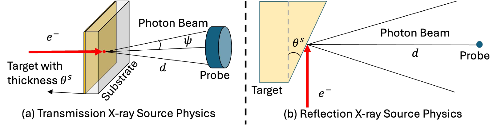

.. _SystemDocs:

==================
System Description
==================

The system description states what you know about your scanner and
what xcal should figure out.

This page has two parts.  The first part explains the notation: how
to write a fact so that xcal knows whether it is known or unknown.
The remaining parts describe each object you create: the targets, the
source, the filters, the detector, and the
:class:`~xcal.System` that collects them.

How to state a fact
-------------------

Every argument in the system description is a physical fact, such
as a thickness, an angle, or a material.  The way you write the
fact tells xcal how much you know:

1. You know the value.  Write it: ``thickness=2.0``.
2. You know only a range.  Write ``xcal.estimate(low, high)``, and
   xcal fits the value within those bounds.
3. You know it is one of a few choices.  Write a list,
   ``material=['Al', 'Cu']``, and xcal tries each choice and keeps
   the one that fits best.

.. code-block:: python

    thickness=2.0                     # 1. known: exactly 2 mm
    thickness=xcal.estimate(0, 10)    # 2. a range: fit between 0 and 10 mm
    material=['Al', 'Cu']             # 3. a few choices: xcal picks

If you cannot even list the choices, omit the material entirely, and
xcal uses the standard candidate list for that component type from
the :ref:`materials catalog <CatalogDocs>`.

The plain value and the list are ordinary Python.  The only new
object is ``xcal.estimate``, the marker for form 2:

.. autoclass:: xcal.estimate

The calibration target
----------------------

Each calibration target is a homogeneous object of one known
material, such as a metal rod.  You state only its material; its
shape is carried by its mask, which you provide, not by this
class.

.. code-block:: python

    targets = [
        xcal.Target(material='Ti'),
        xcal.Target(material='Al'),
        xcal.Target(material='Mg'),
    ]

.. autoclass:: xcal.Target

The source
----------

Pick the source class that matches your instrument.  A commercial
micro-CT system has a tube source: use
:class:`~xcal.TransmissionSource` if the electrons pass through a
thin target (for example the Zeiss Versa), or
:class:`~xcal.ReflectionSource` if they strike a thick angled anode
(most lab sources).  A synchrotron beamline has a known spectrum:
use :class:`~xcal.SynchrotronSource`.

   The two tube source types.  Left: a transmission source generates
   X-rays by passing electrons through a thin metal target; the
   estimated parameter is the target thickness.  Right: a reflection
   source directs electrons onto a thick angled anode; the estimated
   parameter is the takeoff angle.

The source voltage is not part of the source object.  It is an
instrument setting that may differ per scan, so it is given to
:meth:`~xcal.Calibrator.add_scan`.

.. autoclass:: xcal.ReflectionSource

.. autoclass:: xcal.TransmissionSource

.. autoclass:: xcal.SynchrotronSource

The filters
-----------

Each filter is a slab of material in the beam, modeled by Beer's
law.  Create one :class:`~xcal.Filter` per physical filter.  If the
scans differ in which filters were present, say so per scan in
:meth:`~xcal.Calibrator.add_scan`; the filter objects themselves are
created once.

.. code-block:: python

    si_filter = xcal.Filter(material='Si', thickness=xcal.estimate(0, 5))
    al_filter = xcal.Filter(material='Al', thickness=xcal.estimate(0, 10))

.. autoclass:: xcal.Filter

The detector
------------

The detector is an energy-integrating scintillator.  If you do not
know the scintillator material, omit it, and xcal will search the
seven standard scintillators from the catalog.

.. autoclass:: xcal.Scintillator

Putting it together
-------------------

.. autoclass:: xcal.System

.. automethod:: xcal.System.effective_spectrum

.. automethod:: xcal.System.energy_grid

Saving and reading a system
---------------------------

A system saves to a small readable YAML file and loads back, whether
fully specified or feasible:

.. code-block:: python

    est_system.save('est_system.yaml')
    system = xcal.load_system('est_system.yaml')

.. automethod:: xcal.System.save_plot

.. automethod:: xcal.System.save

.. autofunction:: xcal.load_system
